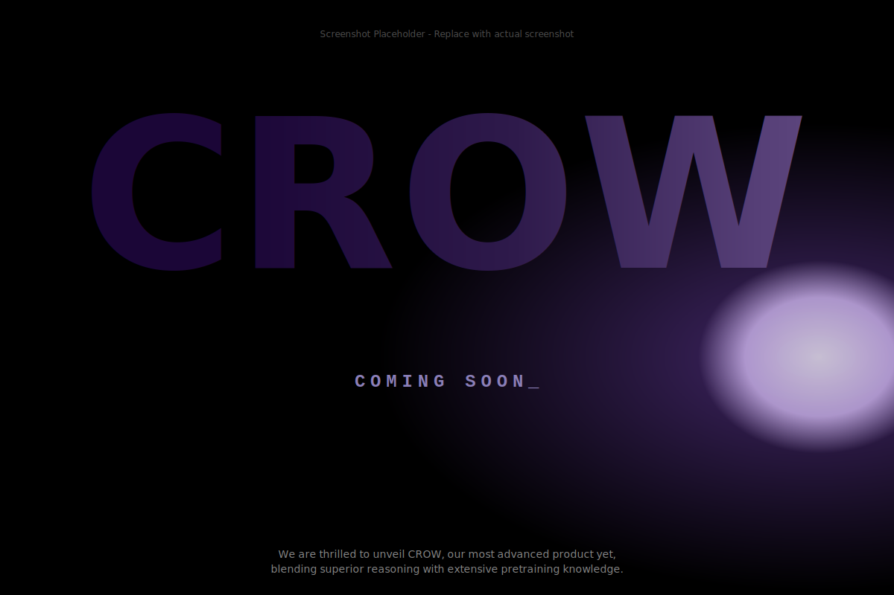

# CROW-B3 UI Kit

CROW-B3 UI Kit is a set of UI components for CROW-B3 projects.
A React component library built with Framer Motion for smooth animations.

## Preview



## Installation

```bash
pnpm add @b3-crow/ui-kit
```

## Local Development

```json
"@b3-crow/ui-kit": "file:../ui-kit"
```

## Setup

### 1. Install Peer Dependencies

```bash
pnpm add react react-dom framer-motion
```

## Usage

### Coming Soon Components

The UI kit includes a complete Coming Soon page with animated components:

```tsx
import {
  AnimatedBackground,
  HeroText,
  Logo,
  ComingSoon,
  Subtitle,
} from '@b3-crow/ui-kit';

function App() {
  return (
    <div>
      <AnimatedBackground />
      <Logo src="/your-logo.png" alt="Your Logo" />
      <HeroText />
      <ComingSoon />
      <Subtitle />
    </div>
  );
}
```

### Available Components

- **AnimatedBackground**: Animated gradient background with blurred circles
- **HeroText**: Large gradient text with fade-in animation
- **Logo**: Animated logo component with breathing effect (requires `src` and `alt` props)
- **ComingSoon**: Typewriter effect text with blinking cursor
- **Subtitle**: Subtitle text with fade-in animation

## Development

```bash
# Install dependencies
pnpm install

# Build the library
pnpm run build

# Lint
pnpm run lint

# Format
pnpm run format
```

## License

MIT
